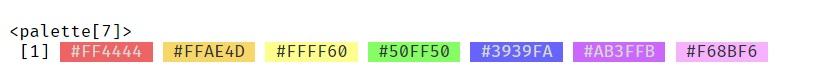
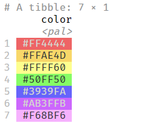

<!-- README.md is generated from README.Rmd. Please edit that file -->

```{r, include = FALSE}
knitr::opts_chunk$set(
  collapse = TRUE,
  comment = '#>',
  fig.path = 'man/figures/README-',
  out.width = '100%'
)
```

# palette 

<!-- badges: start -->
[](https://CRAN.R-project.org/package=palette)
[](https://github.com/christopherkenny/palette/actions/workflows/R-CMD-check.yaml)
[](https://lifecycle.r-lib.org/articles/stages.html#stable)
[](https://christopherkenny.r-universe.dev/palette)
[](https://app.codecov.io/gh/christopherkenny/palette?branch=main)
<!-- badges: end -->

`palette` provides a lightweight infrastructure for working with color palettes in R.
The primary goal is to place colors directly next to their character representations.
To do this, we create a palette class based on [`vctrs`](https://vctrs.r-lib.org/index.html).
We then provide methods for this class, including `print()`, `plot()`, and [`pillar`](https://pillar.r-lib.org/). 
To keep it lightweight and usable in other packages, the only direct dependencies are `vctrs`, `cli`, and `pillar`.

## Installation

You can install the development version of palette from [GitHub](https://github.com/) with:

``` r
# install.packages('pak')
pak::pak('christopherkenny/palette')
```

## Using `palette`

`palette` primarily provides a `palette` `vctrs` class.
Using included data, `roygbiv`, a length 7 vector of hex codes, we can create a palette.

```{r print, results = 'hide'}
library(palette)
palette(roygbiv)
```
<div align = "center">

</div>

<br><br>
<br><br>

There is also a `plot()` method for visualizing the colors:

```{r plot}
plot(palette(roygbiv))
```

For use within `tibble`s, there is a `pillar_shaft` method:

```{r pillar, eval = FALSE}
tibble::tibble(
  color = palette(roygbiv)
)
```

<div align = "center">

</div>
