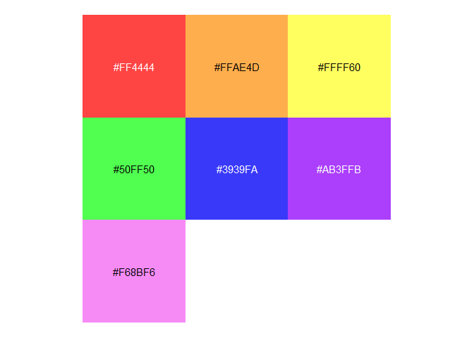

<!-- README.md is generated from README.Rmd. Please edit that file -->

# palette 

<!-- badges: start -->
<!-- badges: end -->

`palette` provides a lightweight infrastructure for working with color
palettes in R. The primary goal is to place colors directly next to
their character representations. To do this, we create a palette class
based on [`vctrs`](https://vctrs.r-lib.org/index.html). We then provide
methods for this class, including `print()`, `plot()`, and
[`pillar`](https://pillar.r-lib.org/). To keep it lightweight and usable
in other packages, the only direct dependencies are `vctrs`, `cli`, and
`pillar`.

## Installation

You can install the development version of palette from
[GitHub](https://github.com/) with:

``` r
# install.packages('pak')
pak::pak('christopherkenny/palette')
```

## Using `palette`

`palette` primarily provides a `palette` `vctrs` class. Using included
data, `roygbiv`, a length 7 vector of hex codes, we can create a
palette.

``` r
library(palette)
#> 
#> Attaching package: 'palette'
#> The following object is masked from 'package:grDevices':
#> 
#>     palette
palette(roygbiv)
#> <palette[7]>
#>  [1]  #FF4444   #FFAE4D   #FFFF60   #50FF50   #3939FA   #AB3FFB  
#>  [2]  #F68BF6
```

There is an included `plot()` method for visualizing the colors:

``` r
plot(palette(roygbiv))
```



For use within `tibble`s, there is a `pillar_shaft` method:

``` r
tibble::tibble(
  color = palette(roygbiv)
)
#> # A tibble: 7 × 1
#>       color
#>       <pal>
#> 1  #FF4444 
#> 2  #FFAE4D 
#> 3  #FFFF60 
#> 4  #50FF50 
#> 5  #3939FA 
#> 6  #AB3FFB 
#> 7  #F68BF6
```
