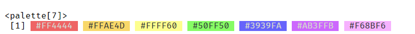
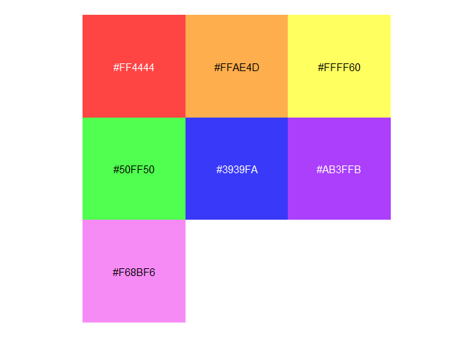

# palette

`palette` provides a lightweight infrastructure for working with color
palettes in R. The primary goal is to place colors directly next to
their character representations. To do this, we create a palette class
based on [`vctrs`](https://vctrs.r-lib.org/index.html). We then provide
methods for this class, including
[`print()`](https://rdrr.io/r/base/print.html),
[`plot()`](https://rdrr.io/r/graphics/plot.default.html), and
[`pillar`](https://pillar.r-lib.org/). To keep it lightweight and usable
in other packages, the only direct dependencies are `vctrs`, `cli`, and
`pillar`.

## Installation

You can install the development version of palette from
[GitHub](https://github.com/) with:

``` r
# install.packages('pak')
pak::pak('christopherkenny/palette')
```

## Using `palette`

`palette` primarily provides a `palette` `vctrs` class. Using included
data, `roygbiv`, a length 7 vector of hex codes, we can create a
palette.

``` r
library(palette)
#> 
#> Attaching package: 'palette'
#> The following object is masked from 'package:grDevices':
#> 
#>     palette
palette(roygbiv)
```



  
  
  
  

There is also a [`plot()`](https://rdrr.io/r/graphics/plot.default.html)
method for visualizing the colors:

``` r
plot(palette(roygbiv))
```



For use within `tibble`s, there is a `pillar_shaft` method:

``` r
tibble::tibble(
  color = palette(roygbiv)
)
```


